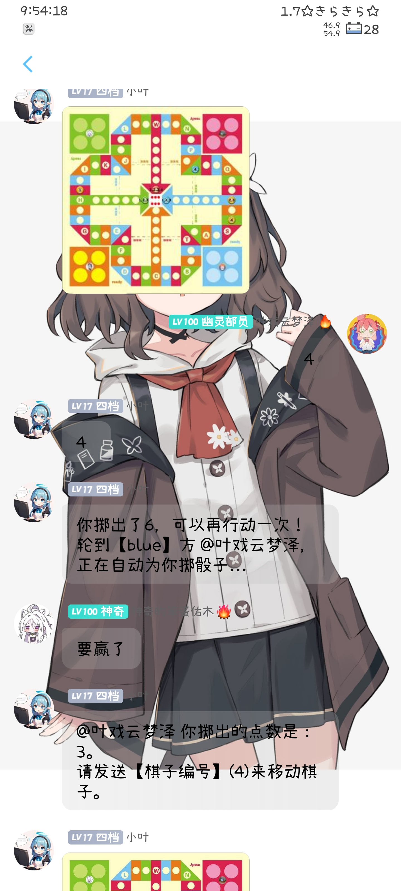

# Sakura-Plugin

一个为 Yunzai-Bot设计的多功能插件，集成了 AI 聊天、图片获取、群聊管理、飞行棋游戏等多种功能。

## ✨ 功能特色

本插件提供丰富的功能，主要分为以下几类：

-   **🖼️ 图片功能**:
    -   获取随机涩图、萝莉图。
    -   通过 `pid` 获取图片。
-   **🤖 AI 功能**:
    -   与 AI 进行智能对话。
    -   AI 图像编辑、风格变换（手办化、雕塑化、毛绒化）。
    -   管理 AI 设定、查看历史对话等。
-   **🔧 群聊管理**:
    -   自动同意入群申请。
    -   清理不活跃成员。
    -   禁言、踢人、设置精华消息等。
-   **🎲 娱乐功能**:
    -   创建和进行飞行棋游戏。
    -   早晚安打卡。
    -   获取 doro 结局图片、GIF 表情包。
-   **⚙️ 其他**:
    -   插件内更新。
    -   美观的指令菜单。

## 🚀 安装指南

1.  **进入 Yunzai-Bot 根目录**
    打开终端，并确保你的当前路径在 Yunzai-Bot 的根目录下。

2.  **克隆插件仓库**
    推荐使用 `git` 进行安装，方便后续更新。
    ```bash
    git clone --depth=1 https://github.com/suzuka-suzuka/sakura-plugin.git ./plugins/sakura-plugin/
    ```

3.  **安装依赖**
    进入插件目录并安装所需依赖。
    ```bash
    cd ./plugins/sakura-plugin
    pnpm install
    ```
    *如果你没有 `pnpm`，请先安装：`npm install -g pnpm`*

## ⚠️ 注意事项

-   **网络环境**: 本插件的部分功能（如AI对话、图片获取等）需要访问国际网络，请确保您的服务器具备相应的网络代理环境。
-   **`canvas` 依赖**: 飞行棋功能依赖 `canvas`。请在Yunzai-Bot 的根目录下`pnpm install canvas`，在某些操作系统上，您可能需要预先安装构建工具。若 `pnpm install canvas`后出现 `canvas` 相关错误，请参考 canvas 官方文档 配置编译环境。

-   **框架兼容性**: 本插件目前仅在 `Napcat` 框架下经过测试，不保证在其他框架（如 `ICQQ`）上的兼容性，请使用者自行测试。
## ⚙️ 配置说明

插件的各项功能可以通过 [Guoba-Plugin](https://github.com/guoba-yunzai/guoba-plugin) 进行可视化配置。

如果你没有安装 Guoba-Plugin，也可以手动修改 `plugins/sakura-plugin/config` 目录下的配置文件。首次启动插件后，默认配置文件会从 `defSet` 目录自动复制到 `config` 目录。

## 📝 使用方法

安装并重启 Yunzai-Bot 后，向机器人发送以下任一指令即可查看功能菜单：

-   `#sakura菜单`
-   `#樱花菜单`
-   `#帮助`

根据菜单中的指令即可使用对应功能。

## 🎨 功能展示

以下是插件部分功能的截图展示：

<p align="center">
  <a href="./readmeresource/1.jpg"></a>
  <a href="./readmeresource/2.jpg"></a>
  <a href="./readmeresource/3.jpg"></a>
  <a href="./readmeresource/4.jpg"></a>
</p>

## 🗓️ 计划实现

计划在未来的版本中加入更多激动人心的功能，包括但不限于：

-   ☐ **P站增强**:
    -   P站日榜查询与定时推送。
    -   订阅指定画师或标签，自动获取最新作品。
-   ☐ **Web配置面板**:
    -   开发独立的网页前端，让用户可以更直观地修改所有插件配置。
-   ☐ **功能扩展**:
    -   增加更多有趣的娱乐和小游戏。
    -   进一步优化AI对话体验和图像处理能力。

## 💬 支持与交流

如果你在使用过程中遇到任何问题，或者有好的建议，欢迎通过以下方式联系：

-   **提交 Issue**: [GitHub Issues](https://github.com/suzuka-suzuka/sakura-plugin/issues)
-   **加入 QQ 交流群**: 1040045728 (遇到问题或想玩飞行棋？欢迎来群里交流！)